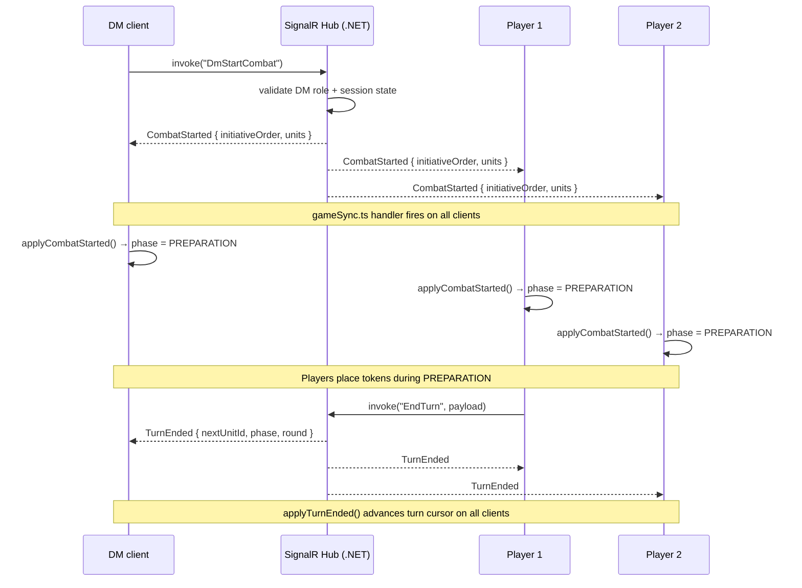

# DnDiscord — Frontend

SolidJS + TypeScript frontend for the DnDiscord Discord Activity. Players join the Activity inside a Discord voice channel, land in a full-screen iframe that runs a 3D turn-based D&D board game, then close the Activity when the session ends without ever leaving Discord. The app talks to `epi-esp-back` (.NET 9) over REST (axios) and real-time (SignalR WebSocket), renders the battle map with BabylonJS 7.x, and ships as a single Docker container served by nginx.

**CSP constraints that shape every technical decision**: the iframe sandbox forbids `eval`, `Function()`, inline blob workers, and all external CDNs. All fonts, icons, and scripts must be bundled or self-hosted. BabylonJS loaders must use `LoadAssetContainerAsync` + instantiated templates — no dynamic `eval`-based shader compilation tricks. Blob workers are replaced with main-thread equivalents.

---

## Table of contents

1. [Architecture overview](#architecture-overview)
2. [Routing / pages](#routing--pages)
3. [Layouts](#layouts)
4. [Services layer](#services-layer)
5. [SignalR / multiplayer](#signalr--multiplayer)
6. [3D engine architecture](#3d-engine-architecture)
7. [Graphics & debug settings](#graphics--debug-settings)
8. [Map editor](#map-editor)
9. [Lights in saved maps](#lights-in-saved-maps)
10. [Campaign maps (server-persisted vs local scratch)](#campaign-maps-server-persisted-vs-local-scratch)
11. [DM panel](#dm-panel)
12. [Tutorial system](#tutorial-system)
13. [i18n](#i18n)
14. [Stores](#stores)
15. [Local dev](#local-dev)
16. [Testing](#testing)
17. [Production / nginx](#production--nginx)
18. [CI/CD](#cicd)
19. [Conventions](#conventions)

---

## Architecture overview

```
┌─────────────────────────────────────────────────────────────┐
│                     Discord Activity iframe                 │
│                                                             │
│  ┌───────────────────────────────────────────────────────┐  │
│  │                    SolidJS Router                     │  │
│  │  MenuShell (nav, auth gate)  GameShell (full-bleed)   │  │
│  └────────────┬──────────────────────────┬───────────────┘  │
│               │ pages                    │ pages            │
│    Home · Campaigns · Characters     BoardGame · MapEditor  │
│    CampaignView · Settings · Rules   CampaignSession        │
│    Practice · Profile · Legal                               │
│               │                          │                  │
│  ┌────────────▼──────────────────────────▼───────────────┐  │
│  │                    Stores (SolidJS)                    │  │
│  │  session · auth · graphics · dmTools · partyChat      │  │
│  │  dialogue · diceRequests · tutorial · sound           │  │
│  │  unitPreview · consent · charactersStore              │  │
│  │  [game] UnitsStore · TilesStore · GameStateStore      │  │
│  └───────────────────┬────────────────────┬──────────────┘  │
│                      │                    │                  │
│  ┌───────────────────▼──────┐  ┌──────────▼───────────────┐ │
│  │    REST services (axios)  │  │   SignalR services        │ │
│  │  campaign · character     │  │  multiplayer.service.ts   │ │
│  │  map · auth · inventory   │  │  gameSync.ts              │ │
│  │  snapshot · discord       │  │  SignalRService.ts         │ │
│  │                           │  │  combatStarted · mapSwitched│ │
│  │  Mappers/normalizers:     │  │  applyState · serverPhase  │ │
│  │  campaign.mappers.ts      │  │  turnEndedLogic            │ │
│  │  multiplayer.normalizers  │  │                            │ │
│  └───────────────────────────┘  └────────────────────────────┘ │
│                                                             │
│  ┌──────────────────────────────────────────────────────┐  │
│  │                  BabylonJS Engine                    │  │
│  │  BabylonEngine · SceneResetManager · ModelLoader     │  │
│  │  GridRenderer · LightManager · VFXManager            │  │
│  │  PostProcessingSetup · QualityPresets · AudioEngine  │  │
│  └──────────────────────────────────────────────────────┘  │
└─────────────────────────────────────────────────────────────┘
         │ REST (axios)                │ WebSocket
         ▼                             ▼
   epi-esp-back (.NET 9)   ←→   SignalR Hub
```

---

## Routing / pages

Routes are defined in `dndiscord-esp/src/index.tsx`. Two layout groups:

| Shell | Path | Page |
|---|---|---|
| MenuShell | `/` | Home |
| MenuShell | `/profile` | ProfilePage |
| MenuShell | `/settings` | SettingsPage |
| MenuShell | `/rules` | Rules (D&D 5e quick reference) |
| MenuShell | `/characters` | CharactersComponent |
| MenuShell | `/characters/create` | CreateCharacter |
| MenuShell | `/characters/:id` | CharacterView |
| MenuShell | `/campaigns` | CampaignsPage |
| MenuShell | `/campaigns/create` | CreateCampaign |
| MenuShell | `/campaigns/:id` | CampaignView |
| MenuShell | `/campaigns/:id/edit` | EditCampaign |
| MenuShell | `/campaigns/:id/manager` | CampaignManagerPage (story-tree, WIP) |
| MenuShell | `/campaigns/:id/sessions` | CampaignSessionsListPage |
| MenuShell | `/campaigns/:id/sessions/:sessionId` | CampaignSessionReplayPage |
| MenuShell | `/map-editor` | MapSelectionScreen |
| MenuShell | `/practice` | PracticeModeSelectPage (4 sandbox modes) |
| GameShell | `/campaigns/:id/lobby` | CampaignLobbyPage |
| GameShell | `/campaigns/:id/session` | CampaignSessionPage |
| GameShell | `/map-editor/:mapId` | MapEditor |
| GameShell | `/practice/:mode` | BoardGame |
| Public | `/login` | LoginPage |
| Public | `/privacy` `/terms` `/legal` `/cookies` | Legal pages |
| Public | `/auth/callback` | AuthCallback |

The legacy `/board` path redirects to `/practice` via a `BoardRedirect` component.

**Practice modes** (no campaign required): `exploration`, `combat`, `dungeon`, `multiplayer`. Each maps to a `BoardGame` variant via the `:mode` param.

---

## Layouts

- `MenuShell` — top bar with back/title/settings/overflow, auth gate (redirects unauthenticated users to `/login`), footer, Discord safe-area padding. Used for all navigation pages.
- `GameShell` — full-bleed, floating exit button, floating help. Used for all in-game views (BoardGame, MapEditor, lobby). Hides the nav chrome so the 3D canvas fills the screen.
- `PageMeta` — context provider that lets child pages set the shell's title, subtitle and back target declaratively.

---

## Services layer

All REST calls go through `dndiscord-esp/src/services/`. The base URL is read from `VITE_API_URL` at build time (defaults to `http://localhost:5054`). In production it is the backend's internal address behind the nginx reverse proxy.

### REST services

| File | Responsibility |
|---|---|
| `api.ts` | Axios instance with auth header injection |
| `auth.service.ts` | Discord OAuth flow, JWT storage, logout |
| `campaign.service.ts` | CRUD for campaigns, membership, invite codes |
| `character.service.ts` | CRUD for characters |
| `inventory.service.ts` | Item grants, wallet operations |
| `map.service.ts` | `GET/POST/DELETE /api/campaigns/{id}/maps` |
| `mapStorage.ts` | localStorage scratch maps (editor-only, not campaign-scoped) |
| `snapshot.service.ts` | Session snapshots (replay) |
| `discord.ts` | Discord Embedded App SDK singleton, context IDs |
| `devLogBridge.ts` | In-dev `console.*` → `POST /api/dev/log` bridge |

### Mappers and normalizers (pure functions)

Two files exist specifically to extract pure logic away from SolidJS store imports so they can be imported in vitest without triggering the SolidJS reactive runtime:

- **`campaign.mappers.ts`** — `mapMemberRole`, `mapCampaignStatus`, `mapCampaignResponse`, `hasScenario`, `displayDungeonMasterName`. Converts raw API response shapes to the frontend `Campaign` type.
- **`signalr/multiplayer.normalizers.ts`** — `normalizeRole`, `normalizeStatus`, `normalizeState`, `normalizePlayer`, `normalizeSession`. Converts camelCase/PascalCase ambiguity from the hub into typed front-end objects.

These are the canonical transformation layers. Do not inline equivalent conversions in components or stores.

---

## SignalR / multiplayer

`SignalRService.ts` wraps `@microsoft/signalr` with WebSocket-only transport (no fallback to long-polling, required by the Discord Activity proxy). Connection is established once on first session join and maintained with automatic reconnect logic.

`multiplayer.service.ts` owns all hub invocations (session lifecycle + DM tools). `gameSync.ts` owns all inbound event handlers for in-game state (`UnitMoved`, `TurnEnded`, `CombatStarted`, etc.). Both call `ensureMultiplayerHandlersRegistered()` which is idempotent — registration runs at most once per connection lifetime and resets on disconnect.

### Typical flow: DM starts combat



### Hub methods (client → server)

Session: `CreateSession`, `JoinSession`, `LeaveSession`, `KickPlayer`, `CreateRoom`, `SubscribeCampaign`, `SubscribeActivity`

Lobby: `SelectCharacter`, `SelectDefaultTemplate`, `StartGame`

In-game: `EndTurn`, `SendUnitMove`, `SendAbilityUsed`

DM tools: `DmMoveToken`, `DmHiddenRoll`, `DmGrantItem`, `DmSpawnUnit`, `DmStartCombat`, `DmEndCombat`, `DmRestartGame`, `DmSwitchMap`, `DmAdjustHp`, `DmAwardExperience`, `DmForceLevelUp`, `DmGrantGold`

Recovery: `RejoinSession`

### Server events (server → client)

Session: `PlayerJoined`, `PlayerLeft`, `PlayerKicked`, `PlayerDisconnected`, `PlayerUpdated`, `SessionUpdated`, `SessionEnded`

Game: `GameStarted`, `UnitMoved`, `TurnEnded`, `CombatStarted`, `CombatEnded`, `AbilityUsed`, `DmTokenMoved`, `DmUnitSpawned`, `MapSwitched`, `UnitHpAdjusted`

DM-only: `DmHiddenRollResult`, `ItemGranted`, `CharacterProgressedDmAck`, `GoldGrantedDmAck`

Public: `CharacterProgressed`, `CharacterProgressedPublic`, `GoldGranted`, `GoldGrantedPublic`, `PartyChatMessage`

### Session persistence

The current `sessionId` and `hubUserId` are persisted to `sessionStorage` (survives page refresh, cleared on tab close). On mount, `tryRecoverSession()` attempts to reconnect via `RejoinSession`. The server replays `GameStarted` + `CombatStarted` via `SendRejoinSnapshotAsync` — the client consumes those via the normal handlers and reconstructs board state without a separate full-sync request.

---

## 3D engine architecture

Everything 3D lives under `dndiscord-esp/src/engine/`.

- **`BabylonEngine.ts`** — orchestrator. Owns the `Engine`, `Scene`, all sub-modules, and the `signalRService` subscription. Subscribes to the graphics store and mirrors changes into the pipeline in one frame. The single source of truth for the rendering loop.
- **`ModelLoader.ts`** — glTF loading via `LoadAssetContainerAsync` + `instantiateModelsToScene`. Templates live off-scene in `AssetContainer`s; instances own their materials and can be disposed without corrupting the template.
- **`SceneResetManager.ts`** — single owner of per-map lifecycle. Call `resetForNewMap()` before loading a new map; it pauses ambient VFX, disposes tracked instances/lights/particles, and renders one clean frame. Call `finishLoad()` after the new map is on screen to resume ambient.
- **`setup/SceneSetup.ts`** — camera + base lights; `setShadowResolution(res)` rebuilds the shadow generator live; `setShadowsEnabled(on)` toggles `scene.shadowsEnabled`.
- **`setup/PostProcessingSetup.ts`** — `DefaultRenderingPipeline` wrapper. `applyEffects(effects)` flips each effect on/off; combat-mode tuning overlays bloom/vignette values when active.
- **`managers/LightManager.ts`** — materializes `SavedMapData.lights[]` into mesh + `PointLight` + particle + flicker observer. Everything registered with `SceneResetManager`.
- **`vfx/VFXManager.ts`** — ambient particles, spell/impact VFX. `pauseAmbient`/`resumeAmbient`/`setAmbientDensity` hooks are called by the engine when graphics settings change.
- **`debug/DebugController.ts`** — F9 Inspector + `setWireframe`, `setBoundingBoxes`, `setCollisionCells`, `showInspector`.
- **`debug/FpsOverlay.ts`** — DOM overlay (fixed-position div, no Babylon GUI) showing FPS, frame time, active mesh count.
- **`quality/QualityPresets.ts`** — low/medium/high/ultra data tables for shadow res, hardware scaling, particle density and effect toggles.
- **`audio/`** — audio engine; SFX and ambient music triggered by game events.

### Hard rules

- **Never set `preserveDrawingBuffer: true`** on the Babylon `Engine`. It leaves the prior frame on the canvas and causes visible ghost trails on restart. Removed in commit `ace71dff`; do not reintroduce.
- **Never filter `scene.meshes` by name prefix** to clean up. The old "nuclear cleanup" in `BabylonEngine.clearAll` was brittle and is gone. Hand map-scoped state to `SceneResetManager` instead.
- **Never call `SceneLoader.ImportMesh` directly** from game code. Go through `ModelLoader.loadModel(path, uniqueName)` so the AssetContainer/instance bookkeeping stays consistent.
- **Clone materials, not templates**: `instantiateModelsToScene(..., /* cloneMaterials */ true)`. Disposing an instance's material must never corrupt the template.
- **Never create a second `Engine`/`Scene` pair** for game mode. The map editor has its own standalone Babylon setup inside `MapEditor.tsx`; `BabylonEngine` is for the game board only.

### Scene-reset lifecycle

Restart and map swap go through a single deterministic path. Never rely on "detect stores cleared" side-effects or name-prefix mesh filtering:

```
BoardGame.restartGame()
  → await clearEngineState()           // GameCanvas
  → await engine.clearAll()             // BabylonEngine
      → await SceneResetManager.resetForNewMap()
          → VFXManager.pauseAmbient()
          → dispose tracked particles + instances + lights
          → render one empty frame
  → clearUnits/clearTiles/resetGameState (stores)
  → await startGame(...)                // populates stores
  → tiles effect fires in GameCanvas → engine.createGrid(...)
      → GridRenderer.createGrid
      → LightManager.materialize(savedMap.lights)
      → SceneResetManager.finishLoad() → VFXManager.resumeAmbient()
```

If you add something that lives only for one map (a dynamic mesh, a new light, a map-scoped particle system), hand it to `SceneResetManager.trackMesh/trackLight/trackParticles` at creation time so the reset cycle cleans it up automatically.

### GameCanvas tiles effect

`src/components/GameCanvas.tsx` coalesces the tiles effect. It skips empty-stores firings (restart transition) and queues incoming updates while `createGrid` is in flight. Do not add a second effect that calls `createGrid` — route through this one.

---

## Graphics & debug settings

User preferences persist in localStorage under `dnd-graphics-settings` via `src/stores/graphics.store.ts`.

- **Preset**: low / medium / high / ultra / custom. Selecting a preset overwrites every tunable; manually toggling anything drops the settings into `custom`.
- **Effects**: bloom, FXAA, vignette, chromatic aberration, glow layer, ambient particles, shadows. All live, no reload required.
- **Shadow resolution**: 512 / 1024 / 2048 / 4096. Rebuilds the `ShadowGenerator` on change.
- **Hardware scaling**: 1.5x (fastest, softest) → 0.5x (sharpest, slowest). Calls `engine.setHardwareScalingLevel`.
- **Debug overlays**: FPS meter (DOM), wireframe, bounding boxes, collision cells (single `LineSystem` draw). Plus an "Open Babylon Inspector" button and the F9 shortcut.

`BabylonEngine` subscribes in `subscribeToGraphicsSettings()` via `createRoot + createEffect`. Do not add ad-hoc subscriptions elsewhere in the engine — keep it centralized.

UI surface: **Settings → Graphics** (`src/pages/SettingsPage.tsx`).

---

## Map editor

`src/pages/MapEditor.tsx` is the orchestrator. Supporting modules:

- `src/components/map-editor/types.ts` — `MapAsset`, `AssetCategory`, `StackedAsset`
- `src/components/map-editor/PaletteData.ts` — `CHARACTER_ASSETS`, `ENEMY_ASSETS`, `ASSET_CATEGORIES` (built from `src/config/assetPacks.ts`)
- `src/components/map-editor/rotation.ts` — `applyRotationYDegrees`, `setRotationYRadians` (the single place that handles the glTF quaternion → Euler dance)
- `src/config/assetFavorites.ts` — ~70 curated items preloaded into ModelLoader on editor mount so the first drop is instant

The map editor has its own standalone BabylonJS setup, independent of the game engine. Do not share engine instances between the two.

The editor has a click-to-place light tool with preset chips (torch / lantern / magical orb) and live preview. Lights are saved in the `SavedMapData.lights` array alongside tiles.

A "Dungeons" map type exists alongside classic flat maps: multi-room layouts connected by teleport portals, edited via a separate wizard flow. The `MapSelectionScreen` lists both types and routes to the appropriate editor.

---

## Lights in saved maps

`SavedMapData` is versioned (`version: 2`) and includes `lights: SavedLightData[]`. `loadMap()` runs `migrateMap()` so pre-existing v1 payloads transparently receive `lights: []`.

Presets live in `src/config/lightPresets.ts` (`torch`, `lantern`, `magical_orb`). Each entry declares mesh path, Y offset, colour, intensity, range, flicker flag, and particle kind. `LightManager.materialize(lights)` is called from `BabylonEngine.createGrid` when a map with lights is loaded — no manual wiring needed at call sites.

---

## Campaign maps (server-persisted vs local scratch)

Two surfaces for map data exist in parallel:

- **Campaign-scoped, server-persisted** — `src/services/map.service.ts` wraps `/api/campaigns/{id}/maps`. DM-only writes. In-session map switching goes through `signalRService.invoke("DmSwitchMap", mapId)` which the backend resolves and broadcasts as `MapSwitched` to every client in the session group. The `mapSwitched.ts` handler reloads the scene via `clearEngineState()` + `setGameState("mapId", ...)` — never a direct `createGrid` call. The DM picks from these maps via the DM Panel → Maps tab. The `mapId` argument to `dmSwitchMap` must be a server-issued UUID; passing a localStorage draft key throws on the server and is caught with a client-side guard.

- **localStorage scratch** — `src/services/mapStorage.ts` remains for the standalone Map Editor page so authors can draft layouts without a live campaign context. For gameplay in a campaign session the server copy is authoritative. The DM Panel's "Import my local maps" button pushes all localStorage drafts to the current campaign (skipping names that already exist server-side), bridging the two surfaces in one click.

---

## DM panel

`src/components/dm/DmPanel.tsx` is a collapsible overlay visible only to the Dungeon Master (`isDm()` gate) during an in-game session. It is organized into tabs:

| Tab | Function |
|---|---|
| **Select** | Default mode. Click a token to open `DmPlayerInspectPanel` (inspect, adjust HP, grant items, award XP/gold) without staging a teleport. |
| **Move** | Enables click-to-teleport. Click a unit to select it, then click any tile to move it. Broadcasts `DmMoveToken` to all clients. |
| **Spawn** | Enemy catalogue (Skeleton, Skeleton Archer, Necromancer, Minion). Click a template to arm spawn mode, click a tile to place. Broadcasts `DmSpawnUnit`. Spawns use `crypto.randomUUID()` for collision-free IDs across concurrent DMs. |
| **Dice** | Hidden dice roller (d4–d100 + modifier + optional label). Result is returned only to the DM via `DmHiddenRollResult`; players never see it. |
| **D20 roll** | `DiceRequestPanel` — DM requests a named D20 roll from a player; the 3D dice modal appears on the player's screen and posts the result back publicly. |
| **Maps** | Available only when a `campaignId` is active. Lists server-persisted maps; clicking one calls `DmSwitchMap`. Includes "Refresh" and "Import my local maps" shortcuts. |

Combat phase controls sit above the tabs and are always visible:

- **Start combat** — visible in FREE_ROAM phase. Invokes `DmStartCombat`; all clients transition to PREPARATION.
- **Stop combat** — visible while combat is running. Invokes `DmEndCombat`; all clients return to FREE_ROAM.
- **AI auto** checkbox — when checked, the DM client runs the enemy AI tick automatically on ENEMY_TURN. When unchecked, the DM drives enemies manually via the enemy hotbar.

`DmPlayerInspectPanel` (opened from a unit click in Select mode or from the unit info card) handles per-player interactions: adjust HP (`DmAdjustHp`), grant items (`DmGrantItem`), award XP (`DmAwardExperience`), force level-up (`DmForceLevelUp`), grant gold (`DmGrantGold`).

---

## Tutorial system

`src/tutorial/steps.ts` defines `TUTORIAL_STEPS: TutorialStep[]`. Each step has an `id`, an optional `route` to navigate to, an optional `target` that matches a `data-tutorial="..."` attribute on a DOM element (used for spotlight/highlight), a `title`, a `body`, and an optional `cta` label.

Current steps:
1. `welcome` — landing at `/`
2. `characters` — spotlights `data-tutorial="nav-characters"`
3. `campaigns` — spotlights `data-tutorial="nav-campaigns"`
4. `campaign-view` — explains session joins
5. `lobby` — navigates to `/practice/combat?demo=1` (demo mode, nothing saved)
6. `prep` — spotlights `data-tutorial="prep-ready"` (placement phase)
7. `combat` — explains turn-based combat
8. `chat` — spotlights `data-tutorial="chat-panel"` (party chat)
9. `done` — routes back to `/`

Tutorial state lives in `src/stores/tutorial.store.ts`. The tutorial can be replayed from **Settings → Tutorial → Start**.

Event listeners added during tutorial steps (e.g. for `data-tutorial` spotlight targeting) are torn down symmetrically in `onCleanup` to avoid listener leaks on step transitions.

---

## i18n

`src/i18n/en.ts` is a flat `as const` string map keyed by dot-separated identifiers (`topbar.help`, `page.campaigns.title`, etc.). The `t()` helper resolves keys at runtime.

Currently English-only. Legal pages (`/privacy`, `/terms`, `/legal`, `/cookies`, `/login`) were translated to English in PR #77. If additional locales are added, `src/i18n/index.ts` is the registration point.

The string map is comprehensive — it covers top bar, common actions, every named page, the home hero, campaign cards, DM/player board HUD, character creation, settings sections including GDPR export/delete, map editor labels, and session replay.

---

## Stores

| Store | Key data | Persistence |
|---|---|---|
| `auth.store.ts` | JWT, Discord user info, activity errors | `localStorage` (token) |
| `session.store.ts` | Active session info, players, hub user ID, game-started payload | `sessionStorage` |
| `graphics.store.ts` | Quality preset, effect toggles, shadow res, scaling | `localStorage` |
| `dmTools.store.ts` | DM active mode, drag unit, spawn template, hidden rolls, granted items, progression events, gold grants, AI auto flag | In-memory |
| `partyChat.store.ts` | Party chat messages from Discord voice channel | In-memory |
| `dialogue.store.ts` | DM message overlay, player speech bubbles | In-memory |
| `diceRequests.store.ts` | Pending dice roll requests from DM | In-memory |
| `tutorial.store.ts` | Current step index, active/done flags | `localStorage` |
| `sound.store.ts` | SFX and music on/off | `localStorage` |
| `consent.store.ts` | Cookie consent state | `localStorage` |
| `unitPreview.store.ts` | Unit being hovered/inspected | In-memory |
| `charactersStore.ts` | Character list cache | In-memory |
| `session-map.store.ts` | Current map context within a session | In-memory |
| `game/UnitsStore` | Unit roster (position, HP, abilities, status) | In-memory |
| `game/TilesStore` | Grid tile map (occupancy, pathfinder) | In-memory |
| `game/GameStateStore` | Phase, turn order, turn index, path preview, highlights, combat log | In-memory |

**Important**: `createStore<Record<K, V>>` + `setStore({})` merges, it does not clear. Every helper that clears a record store must iterate and delete keys explicitly. See `clearUnits` / `clearTiles` implementations for the pattern.

---

## Local dev

```sh
cd dndiscord-esp
npm install
```

```sh
npm run dev              # Vite dev server on localhost:3000
npm run dev:tunnel       # Cloudflare tunnel — required for Discord Activity testing
                         # (Discord must be able to reach your local server via HTTPS)
```

The tunnel command requires `cloudflared` on your PATH. The tunnel URL changes each run; update the Activity URL in the Discord developer portal accordingly.

By default the frontend expects the backend on `http://localhost:5054`. The .NET backend's `launchSettings.json` defaults to port 5261, so the ports may differ. Override with:

```sh
VITE_API_URL=http://localhost:5261 npm run dev
```

The Discord SDK initialization times out gracefully after 5 seconds when running outside the Activity iframe, so all pages work standalone in the browser for development.

---

## Testing

```sh
cd dndiscord-esp
npm run test             # vitest run (all test suites)
```

- **Vitest 3.x** — not 4.x. The rolldown native binding in vitest 4.x was broken on Windows at the time of adoption and is pinned.
- **Pure TS logic only** — no SolidJS component tests, no BabylonJS rendering tests.
- Test files are colocated with source:
  - `src/game/__tests__/` — TurnManager, Pathfinder, GridUtils, CollisionUtils, DamageCalc
  - `src/utils/__tests__/` — utility helpers
  - `src/services/__tests__/` — campaign mappers, map.service
  - `src/services/signalr/__tests__/` — `applyTurnEnded`, `mapServerPhase`, `combatStarted`, normalizers
  - `src/hooks/__tests__/` — `useLastCampaign`
  - `src/stores/__tests__/` — store helpers
  - `src/components/map-editor/__tests__/` — rotation helpers

### The SolidJS import trap

Vitest runs outside the browser's reactive context. Any file that has a **top-level** SolidJS store import (e.g. `createStore(...)` at module scope) will throw when imported in a test. The solution is to extract pure functions into separate files that import nothing from `solid-js`:

| Pure extraction | Origin file |
|---|---|
| `src/game/utils/DamageCalc.ts` | `CombatActions.ts` |
| `src/services/campaign.mappers.ts` | `campaign.service.ts` |
| `src/services/signalr/multiplayer.normalizers.ts` | `multiplayer.service.ts` |
| `src/services/signalr/turnEndedLogic.ts` | `gameSync.ts` |
| `src/services/signalr/serverPhase.ts` | `gameSync.ts` |
| `src/services/signalr/applyState.ts` | `gameSync.ts` |

When adding new testable logic in a file that imports a store at the top level, extract the pure function first before writing the test.

---

## Production / nginx

`dndiscord-esp/nginx.conf` serves the Vite SPA with three cache tiers plus an SPA fallback:

1. **Hashed bundles** (`/assets/*-XXXXXXXX.js|css|...`) — `Cache-Control: public, immutable` for 1 year. The content hash in the filename guarantees the URL changes when the bytes change.
2. **Public static assets** (`*.png|jpg|glb|gltf|svg|...`) — `Cache-Control: public, must-revalidate` for 1 day. These ship with stable filenames and are cache-busted by a `?v=APP_VERSION` query string at deploy time. Marked `must-revalidate` (not `immutable`) because Discord's activity proxy would otherwise serve stale portraits and models indefinitely.
3. **Unhashed JS/CSS from /public** — same 1-day `must-revalidate` rule.
4. **SPA fallback** — `try_files $uri $uri/ /index.html` so client-side routes work on hard refresh (not a cache tier; routing only).

Security headers allow iframe embedding from `*.discordsays.com`, `discordsays.com`, `discord.com`, `*.discord.com` (required for the Activity). `X-Frame-Options` is intentionally absent — sending it would cause the browser to refuse the Discord iframe.

SignalR WebSocket upgrades are handled transparently by nginx's `try_files` chain since the WebSocket connection goes to the backend, not nginx.

### Hard-won lesson: nginx regex quantifiers

Regexes containing `{n,}` quantifiers (e.g. `{8,}`) **must be quoted** in `nginx.conf` location blocks. Without quotes, nginx parses the brace as a directive block opener and the config fails to load, crash-looping the production container.

Commit `01fb4f6d` was a hotfix for exactly this. The CI pipeline now validates the config on every push:

```sh
# Run this locally before merging any nginx.conf change:
docker run --rm \
  -v $PWD/nginx.conf:/etc/nginx/conf.d/default.conf:ro \
  nginx:alpine nginx -t
```

The CI step (`Validate nginx.conf` in `ci.yml`) mounts the file the same way and runs `nginx -t` on ubuntu-latest.

---

## CI/CD

### GitHub Actions (`.github/workflows/ci.yml`)

Runs on every push and pull request to `main` and `dev`.

```
Install → Typecheck → Test → Build → Validate nginx.conf → Production image smoke test
```

1. **Install** — deletes `package-lock.json` then runs `npm install`. The committed lockfile is generated on Windows and lacks the Linux rollup binaries; CI reinstalls fresh and caches `~/.npm` keyed on `package.json` content hash to avoid redundant network round-trips.
2. **Typecheck** — `tsc -b`
3. **Test** — `vitest run`
4. **Build** — `vite build`
5. **Validate nginx.conf** — `docker run nginx:alpine nginx -t` (catches syntax errors including unquoted regex quantifiers before they reach Dokploy)
6. **Production image smoke test** — builds the Dockerfile, starts the container on port 8080, polls `http://localhost:8080/` five times, fails if the container never responds. Catches Dockerfile typos, missing `COPY` targets, and multi-stage build regressions.

### Deployment

Dokploy auto-deploys on push to the configured branch via the GitHub App integration. No manual deploy step.

### Cross-platform lockfile

`package-lock.json` generated on Windows includes only `@rollup/rollup-win32-x64-msvc` and no Linux binary. The lockfile is committed anyway for local Windows dev consistency, but CI and Docker both discard it:

- **CI**: `rm -f package-lock.json && npm install`
- **Dockerfile**: copies only `package.json`, not `package-lock.json`

If you switch to a Linux dev machine, delete the lockfile and regenerate it before committing.

---

## Conventions

- **POC scope** — keep it minimal. Resist over-engineering; the goal is a working demo, not a production SaaS.
- **Branch target** — PRs target `dev`. `main` only receives merges from `dev` at release time.
- **Commits** — no `Co-Authored-By` or AI attribution lines.
- **Engine edits** — before touching `BabylonEngine.ts`, `ModelLoader.ts`, or `SceneResetManager.ts`, re-read the [Hard rules](#hard-rules) section above.
- **Store clears** — `setStore({})` on a `Record` store merges, not clears. Use explicit key deletion. See `clearUnits` / `clearTiles`.
- **DM gates** — DM-only UI and hub invocations must be gated by `isDm()` on the client **and** enforced by role checks on the server. Never rely solely on client-side hiding.
- **Hub method `mapId` type** — `DmSwitchMap` expects a server-issued UUID. The `dmSwitchMap()` service function validates the shape before invoking the hub; a localStorage draft key will throw server-side.
